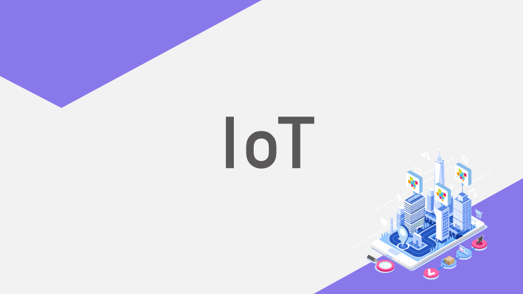

<font size="5"><center>**How GridDB works with IoT data**</center></font>




Personally, I have been using GridDB for a time-series database for a variety of applications including the stock price prediction. GridDB has a lot of plugins when it comes to storing key-value pairs filtered by epoch timestamp. As we are aware, there are a lot of IoT startups that are building their tech products that often need the requirement for a scalable time-series database.

This blog will demonstrate how smoothly Griddb handles all the database operations of IoT devices. We will also store sensor data with the help of Raspberry Pi and subscribe MQTT events. To make life easier for IoT developers, GridDB has very detailed documentation targeted to IoT device data.

[Querying IoT dataset in Jupyter Notebook](https://docs.griddb.net/tutorial/jupyter/) 

In this article, the functionality of JDBC for the IoT data analysis is implemented in python3. The prerequisites are Jupyter notebook, python3, Kafka, etc.
GridDB works really close with CRUD operation with huge sensor and IoT device data. The server-driven cloud triggers can easily be implemented with GridDB and Google Cloud features. The IoT developer leverages GridDB the scalability, flexibility, and extensible time-series GridDB databases.

We have also done a demo with Raspberry Pi, and hosting it on the MQTT server for publishing topics like temperature and humidity. Initially GridDB data will have Google Cloud functions which would have susbcribed to MQTT events.

 
**Installation of GridDB**

To install GridDB client, it is open-source and can be downloaded from github.


```
git  clone https://github.com/griddb/griddb.git
```

The step-by-step installation guidelines are given here.


```
https://github.com/griddb/griddb
```

**IoT Database Schema**

The IoT industry is projected to reach 1.5 trillion USD by 2030, and enormous data will be generated by billions of connected devices. Two common database architectural patterns emerge:

1. **Hub**: When IoT devices send the time-series data for storage, operation, and analysis, then it is assumed that all devices are having a reliable internet connection.
2. **Edge & Hub**: When there is not a reliable internet connection, then IoT devices centralize the DB instances and also enable the dual-write time-series telemetry DB instance.


**IoT data operation in GridDB container**

To perform DB operation it is very handy to use cursor object for the tables. Let us define a function for fetching sensor data from GridDB container.


```
def query_sensor(curs, table):
    curs.execute("select count(*) from "+table)
    return curs.fetchall()[0][0]
```


We can similarly define other operations like delete, search, etc, and will use directly these methods in our script. Let us consider the below SQL query for fetching the data from the table.


```
curs = conn.cursor()
    
sql ="""select TO_EPOCH_MS(dt)/1000 as start, TO_EPOCH_MS((select min(dt) from """+table+""" where dt > a.dt   and message = 'OFF'  ))/1000,
    TIMESTAMPDIFF(SECOND, (select min(dt) from """+table+""" where dt > a.dt  and message = 'OFF' ), dt )
from """+table+""" as a where a.message = 'ON' order by dt asc; """
curs.execute(sql)
data = curs.fetchall()
print(data)
```


This is a SQL query to fetch the records where the motion sensor was turned on/off and sorting the values by timestamp. We can further use Pandas and Matplotlib for data analysis.

The data frame will look like this: \
`          On           Off  Duration`


```
0  1309416847  1.309417e+09      13.0
1  1309417097  1.309418e+09    1190.0
2  1309417389  1.309418e+09     898.0
3  1309418175  1.309418e+09     111.0
4  1309423271  1.309441e+09   18192.0
5  1309441925  1.309442e+09     162.0
6  1309442280           NaN       NaN

```

**Raspberry Pi Data with GridDB database**

We will now see how GridDB can be used to store the time-series humidity and temperature data. The Raspberry Pi is used to receive the data from the sensor. Furthermore, we have also integrated the Google Cloud functions which is subscribed to MQTT event triggers.

Let us define the various methods in python, to send sensor data to GridDb, and parsing the MQTT message.


```
def on_message(client, userdata, msg):
  sensor_data = parse_mqtt_message(msg.topic,    msg.payload.decode('utf-8'))
  send_sensor_data_to_griddb(sensor_data)
```


```
def parse_mqtt_message(topic, payload):
  match = re.match('home/([^/]+)/([^/]+)', topic)
  location = match.group(1)
  measurement = match.group(2)
  return SensorData(location, measurement, float(payload))
```


```
def send_sensor_data_to_griddb(sensor_data):
  json_body = [
    {
      'measurement': sensor_data.measurement,
      'tags': {
        'location': sensor_data.location
      },
      'fields': {
        'value': sensor_data.value
      }
    }
  ]
  griddb_client.write_points(json_body)
```


 
The full source code is [here](https://github.com/6vedant/GridDB-IoT-MQTT).

**Advantages of GridDB for IoT device data**

As IoT data are enormous and it is emitted for each and every millisecond, GridDB is high performant when it comes to storing the delta energy values in milliseconds.

Its hybrid composition of In-memory and Disk architecture is optimized for data manipulation. More important, IoT startups prefer open-source time-series database which can be integrated seamlessly. One of the founding pillars of GridDB is it is highly optimized for a wide range of IoT devices.

**Conclusion** 

GridDB works perfectly when it comes to performance and scalability for time-series databases. Hence, IoT developers should definitely give it a try with GridDB.
